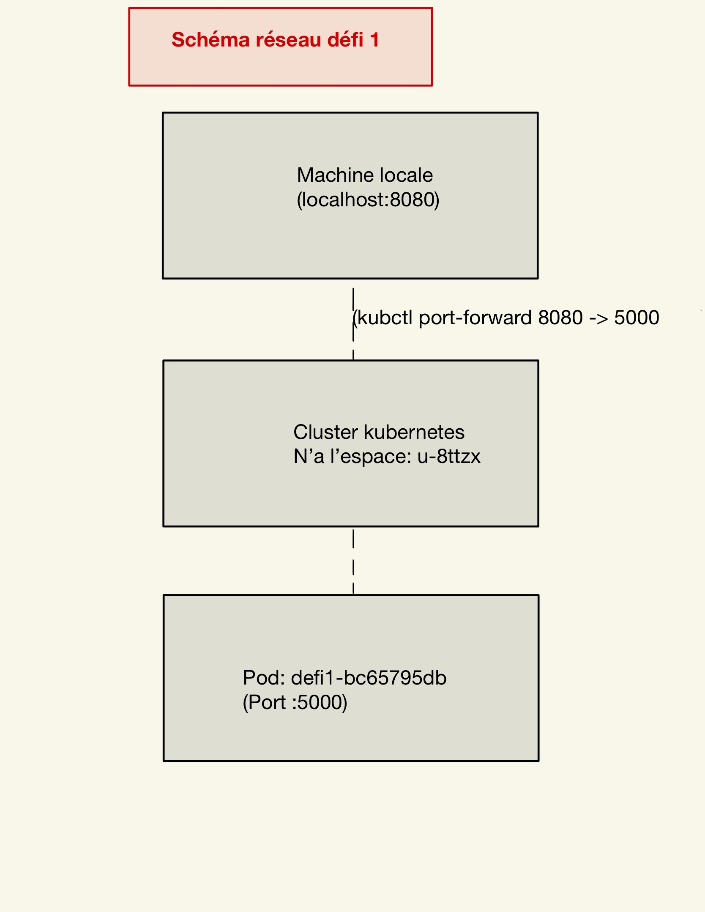
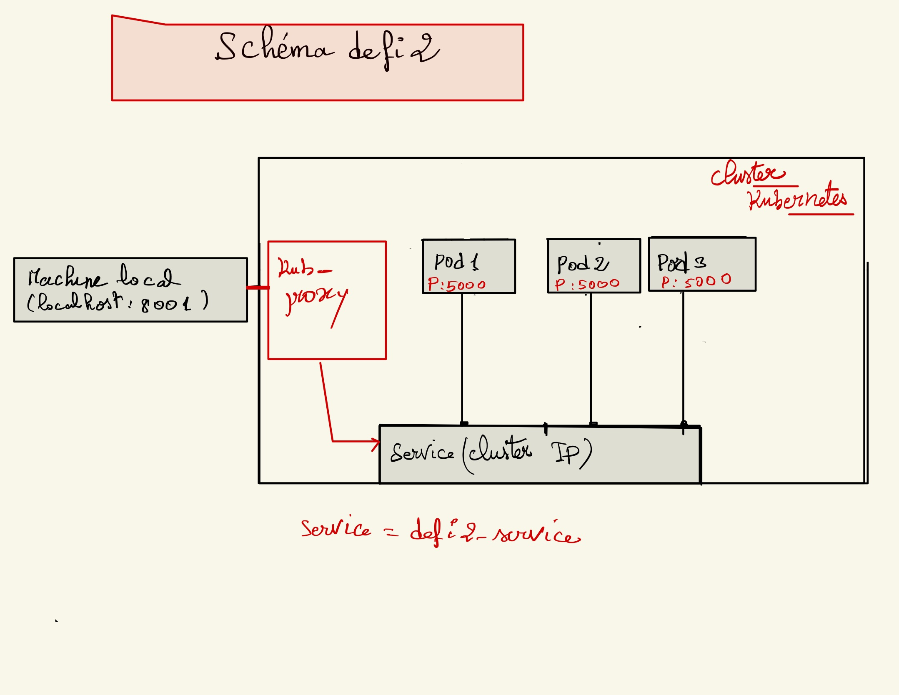

# Défis

## Défi 1 :

**- Création du déploiement:**

``` kubectl create deployment defi1 -n u-8ttzx --image=xhelozs/csc8567:v1```

**- Connexion sur le pod créé pour voir le port sur écoute ( le nom du pod est defi1-bc65795db-cwwd9):** 

```kubectl exec -it defi1-bc65795db-cwwd9 -n u-8ttzx -- sh ```

```
root@defi1-bc65795db-cwwd9:/# netstat -tuln
Active Internet connections (only servers)
Proto Recv-Q Send-Q Local Address           Foreign Address         State      
tcp        0      0 0.0.0.0:5000            0.0.0.0:*               LISTEN  

```
**- Retour sur la machine hote**

**- Mapping de ce port 5000 avec le port 8080 du localhost:**

``` kubectl port-forward pods/defi1-bc65795db-cwwd9 8080:5000 -n u-8ttzx ```



## Défi 2 :

**- Création du déploiement:**

```
kubectl create deployment defi2 --image=xhelozs/csc8567:v1 -n u-8ttzx -o yaml >defi2.yaml

```

**- Modification du fichier defi2.yaml :** 

Allocation et limitation de ressources

**- Recréation du déploiement:**

```
kubectl apply -f defi2.yaml -n u-8ttzx

```

**- Connection au service via le proxy :**

```
kubectl proxy
```

**- Navigateur :** http://127.0.0.1:8001/api/v1/namespaces/u-8ttzx/services/defi2-service/proxy/


**- Questions supplémentaires** :

- Quel est le but d'un service ?
     - Un Service dans Kubernetes permet d'exposer un ensemble de Pods et d'assurer la connectivité réseau entre eux. Il permet aussi de définir une politique de routage du trafic (ex. : ClusterIP, NodePort, LoadBalancer).

- Quelle est la différence entre les services ClusterIP et NodePort ?
     - **ClusterIP** : Il expose le service à l'intérieur du cluster uniquement, rendant le service accessible uniquement depuis les autres ressources du cluster.
     - **NodePort** : Il expose le service en dehors du cluster en attribuant un port statique sur chaque nœud du cluster, permettant ainsi l'accès au service via une IP externe du nœud et le port attribué.




## Défi 3 :

**- Création de l'image Docker** :

```
docker build -t ithiam/site_django:v4 -f Dockerfile.api .

```

**- Envoie de l'image sur Docker Hub** :

```
docker push ithiam/site_django:v4

```
**- Edition du fichier defi3.yaml pour le deploiement du site avec les deux applications et le fichier postgresql.yaml pour deploiement de la base de données**


**- Création du site** :

```
kubectl apply -f defi3.yaml -n u-8ttzx

```

**- Création de la base de données** :

```
kubectl apply -f postgresql.yaml -n u-8ttzx

```
**- Connection au service via le proxy :**

```
kubectl proxy
```

**- Navigateur :** http://127.0.0.1:8001/api/v1/namespaces/u-8ttzx/services/defi2-service/proxy/

**- Questions supplémentaires** :

  - Quelle est la différence entre un service ClusterIP et NodePort ?

      Un ClusterIP expose un service uniquement à l’intérieur du cluster Kubernetes. Cela signifie que seuls les Pods et services dans le cluster peuvent accéder à ce service, mais il est invisible et inaccessible depuis l'extérieur du cluster. En revanche, un NodePort expose un service à l’extérieur du cluster. Il attribue un port statique sur chaque nœud du cluster, permettant l'accès au service via l'IP d’un nœud et le port correspondant. Ainsi, ClusterIP est utilisé pour des communications internes entre services, tandis que NodePort permet de rendre un service accessible depuis l'extérieur du cluster.

  - Quelle critique pouvez-vous donner vis-à-vis de l'utilisation d'un Pod pour la base de données ?

      Utiliser un Pod pour déployer une base de données n'est pas idéal, car les Pods sont éphémères et peuvent être détruits ou redémarrés, ce qui entraînerait la perte des données stockées à l'intérieur. Les bases de données ont besoin de persistance et de haute disponibilité, ce que les Pods ne garantissent pas. 

  - Sur quel type de ressource KubeDNS crée des entrées ? Quelle information propre a la ressource est utilisée ?

      KubeDNS génère des entrées DNS pour les services déployés dans Kubernetes. Chaque service reçoit une adresse DNS permettant aux autres Pods ou services du même cluster de le localiser facilement. 
      Cela permet aux applications du cluster de communiquer entre elles en utilisant des noms de services au lieu d’adresses IP, simplifiant ainsi la gestion des connexions.


## Défi 4 :

**- Edition du fichier ingress_defi4.yaml**

**- Création de l'Ingress** :

```
kubectl apply -f ingress_defi4.yaml -n u-8ttzx

```

**- Connection au site :**

    **Navigateur :**  https://django.super.csc8567.luxbulb.org/


## Défi 5 :

**- Création des deux images docker** :

``` 
docker push ithiam/frontend:v2

docker push ithiam/api:v2

```

**- Edition des fichiers des deployments** :   
      
      - frontend.yaml
      - api.yaml
      - postgresql.yam

**- Edition du fichier de l'Ingres** :

      - ingress_defi5.yaml

**- Déploiment** :

```
 kubectl apply -f frontend.yaml 

 kubectl apply -f api.yaml 

 kubectl apply -f postgresql.yaml 

 kubectl apply -f ingress.yaml

 ```


